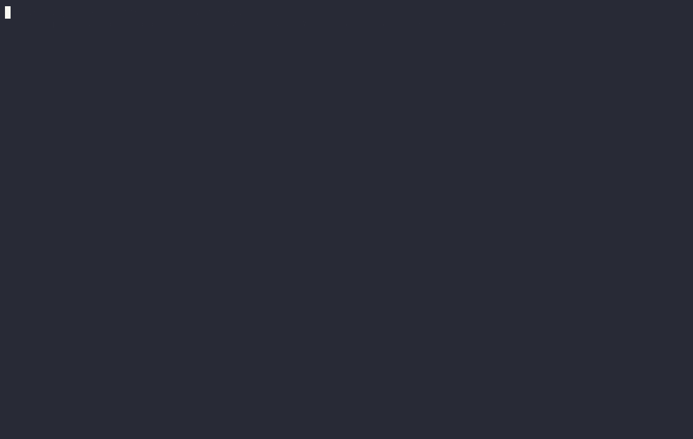
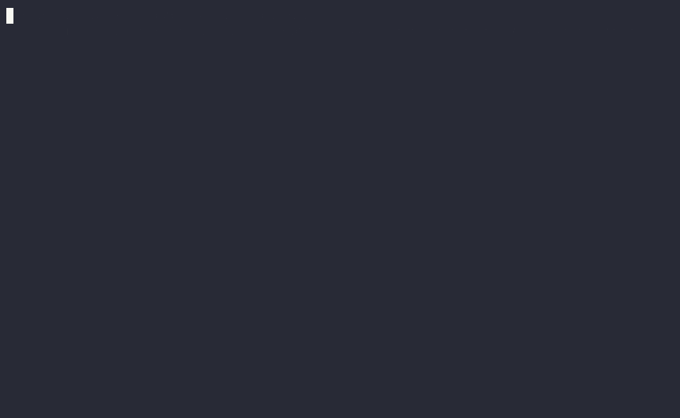

# EVOKE

**A KV-cache memory hierarchy with recompute-free block recovery for LLM serving.**

Long-running LLM agent sessions outgrow the KV cache within a few turns. When that happens, production servers either truncate the oldest history (and lose information that may still matter) or re-prefill the full conversation on every call (and pay full forward-pass compute regardless of whether the prior context turned out to be needed).

EVOKE adds a third option: evict cold blocks to host RAM at metadata cost, and when a future turn needs them, splice the original K and V tensors back into the unified cache at a new logical position with one RoPE phase shift, with **no model forward pass**. The mechanism lives in a forked llama.cpp (three new C primitives) plus a Python policy layer and an OpenAI-compatible server.

### Qwen 2.5 7B (pure attention)


*14-turn session, 1024-token budget. A fact is planted at turn 1 ("favorite number = 4242"), 12 unrelated knowledge questions fill the session, the fact is probed at turn 14. The session survives **40 evictions and 13 recoveries** and the model recalls "4242".*

### Qwen 3.5 9B (hybrid Mamba/Attention + mrope, thinking-mode)


*Same demo on a hybrid architecture. `<think>...</think>` traces handled via `EVOKE_SUPPRESS_THINKING_STRIP=1`. **26 evictions, 4 recoveries**, fact recalled.*

## What it actually is

- **Three C primitives in a [forked llama.cpp](https://github.com/Anyesh/llama.cpp).** `llama_kv_block_save` and `llama_kv_block_load` serialise a position range's K/V tensors to a host buffer and splice them back with per-cell RoPE re-anchoring; `llama_attn_capture_*` taps per-head softmax attention weights from up to 16 chosen transformer layers once per decode.
- **A Python policy layer** (`evoke/manager.py`, `evoke/scorer.py`, `evoke/attention_scorer.py`) that drives watermark-triggered eviction via a multi-signal scorer and routes recovery through three backends: `discard`, `breadcrumb`, or `kv_restore` (the recompute-free splice).
- **An OpenAI-compatible chat-completions server** (`evoke/server.py`) that exposes EVOKE as a stateful endpoint. Persistent KV survives across requests; only the new tail of each prompt is decoded. Multi-session pool, prefix caching, `<think>...</think>` and tool-call handling included.
- **Cross-architecture coverage** end-to-end on Qwen 2.5 7B and Llama 3.1 8B (full NIAH + multifact + agent\_bench budget sweeps), plus full NIAH and multifact grids at b=1024 on Qwen 3.5 9B (hybrid Mamba/Attention + thinking) and Qwen 3.6 35B-A3B (MoE + thinking, IQ2 quant).

## What the numbers say

All numbers below come from a single consumer-class GPU host (RTX 4070 Ti SUPER, 16 GB VRAM, CUDA 13.1, Flash Attention enabled). Server-class hardware (A100/H100) is not measured. See `paper/paper.pdf` §7 for full tables.

**Primitive latency.** `kv_block_load` runs in 0.48–7.25 ms across block sizes 20–1280 on Qwen 2.5 7B, 1.78–15.66 ms on Llama 3.1 8B. Full save+load lifecycle is **5.9–7.5× faster than re-prefilling the same tokens** on Qwen, **2.6–2.8× on Llama**.

| Block (tokens) | save (ms) | load (ms) | re-prefill (ms) | speedup |
|---:|---:|---:|---:|---:|
|   20 |  1.10 | 0.48 |  11.90 | 25× |
|   40 |  1.61 | 0.70 |  13.78 | 20× |
|  160 |  4.69 | 1.50 |  32.60 | 22× |
|  640 | 16.37 | 4.34 | 118.36 | 27× |
| 1280 | 31.90 | 7.25 | 232.18 | 32× |

**Integrated system, 14-turn planted-fact head-to-head (n=15, budget 1024 vs n\_ctx=16384, ~3.6× compression).** EVOKE matches the unconstrained `no_eviction` baseline's recall (15/15 probe-correct) at `truncate`-parity wall-clock (21.20 s [21.07, 21.33] vs 22.11 s [19.46, 24.76]; `truncate`'s SSH-launch jitter dominates its CI). The honest framing is **identical footprint to truncation plus a recovery capability truncation fundamentally lacks**, not a speed win.

**Multi-fact n=15 sweep, budget 1024, Qwen 2.5 7B (75 facts per cell).** Recovery-bearing policies cluster at **48–64%** absolute pass rate; every recovery-less baseline (recency, StreamingLLM, EVOKE-discard/breadcrumb, H2O, SnapKV) lands at **0–4%**.

**NIAH at 3.6× compression.** Recovery-bearing reaches **96–100% on Qwen 2.5 7B** and **76–88% on Llama 3.1 8B**. Recovery-less baselines flatten at 0–44% at the tightest budget. (SnapKV climbs to 68–84% on Llama NIAH at looser budgets as a documented single-needle exception driven by heavy-hitter retention.)

**Cross-architecture multifact at b=1024 (n=5).** The recovery-bearing-vs-recovery-less divide reproduces on architecturally diverse substrates: **Qwen 3.5 9B** (hybrid Mamba/Attention + thinking) reaches **68% [48.41, 82.80]** EVOKE vs 0–8% recovery-less (H2O 8% best comparator); **Qwen 3.6 35B-A3B** (MoE + thinking, IQ2_M) reaches **52% [33.50, 69.97]** EVOKE vs 0% every baseline including H2O. Absolute pass-rate falls with quantization aggressiveness but the relative advantage (5×+ over best baseline) holds across all three architectures.

**Eviction-scoring winner is budget-regime-dependent.** A same-substrate InfLLM adaptation at K=8 statistically separates from EVOKE at the tightest budget on both fully-swept architectures (Llama b=512: InfLLM **81.3% [71.1, 88.5]** vs evoke\_attention **60.0% [48.7, 70.3]**, non-overlapping Wilson CIs; Qwen b=512: InfLLM 81.3% [71.1, 88.5] vs evoke\_kv\_restore 50.7% [39.6, 61.7], also non-overlapping). EVOKE pulls ahead only at the loosest budget where headroom lets the scorer pay off. Both policies use the same recompute-free recovery primitive; the load-bearing contribution is the primitive itself, with the attention scorer as a regime-targeted improvement on top.

## How relevance scoring works

Per-block score in [0, 1]; lowest scores get evicted under watermark pressure. Per the Appendix A.4 factorial in the paper, one decision drives the bulk of the gain:

- **(load-bearing) Retrieval-tuned embedding (`bge-small-en-v1.5`)** scoring blocks against the raw user-message text. Marginal +72pp on NIAH at b=512. LM-hidden-state cosines crowd into a 0.85–0.93 band on retrieval-style workloads; bge-small widens it to 0.4–0.9, which is what lets top-k selection actually pick the needle block over haystack noise.
- **(conditional)** Running the recovery splice *before* the new user-message tail is decoded. Adds +20pp when the retrieval embedder is on; actively hurts when it's off.
- **(zero measurable effect on the benchmark we ran the factorial against)** Resident-gate that excludes breadcrumbs whose similarity doesn't beat the best non-current-turn resident block.
- **The model's own attention** (`evoke_attention` policy). A second softmax for one or more chosen transformer layers runs alongside the main attention path. Regime-targeted: pays off on single-needle workloads where attention concentrates on one recoverable target; on multi-fact at tight budget, a larger-K pure-retrieval recovery can outperform it.
- **Stability priors:** recency, StreamingLLM-style sink protection, USER/ASSISTANT source-type floors, harness-supplied `evoke_priority` and `evoke_pinned` tags.

See `paper/paper.pdf` §4 for the scoring equation, Appendix A.4 for the factorial, Appendix A.1 for the attention-scorer ablation.

## Where this works (and where it doesn't)

- **Substrate.** EVOKE requires Flash Attention enabled (V row-aligned) on Ampere-or-later CUDA. With FA off, the splice runs ~280× slower and the speedup over re-prefill collapses (paper §3.1). CPU, older Vulkan/Metal, and pre-Ampere CUDA are out of scope.
- **vLLM.** We ported the EVOKE policy layer and the recovery primitive to vLLM v1 with PagedAttention (fork at [Anyesh/vllm](https://github.com/Anyesh/vllm)). The recovery **primitive** composes from existing kernels (`swap_blocks_batch` + `rotary_embedding`) with no CUDA-side work. The **policy layer** does not transfer: vLLM's V1 scheduler has no session-scoped logical position space for similarity-recovered bytes to occupy. The port surfaces a missing abstraction on production paged substrates; it does not produce a working similarity-recovery system on vLLM v1 (paper §7.5).
- **Quantized KV cache.** 4-bit symmetric KV (`type_k=type_v=q4_0`) collapses generation to incoherent token salad on Qwen 2.5 7B (paper Appendix A.8). KIVI-style per-channel-per-token asymmetric quantization is **not** in stock llama.cpp and is the open comparison we have *not* run.
- **Memory cost.** Saved blocks live in host RAM. Qwen 2.5 7B at `block_size=128` costs 7 MiB per block, ~7 GiB per 1000-block session. Multi-tenant deployments pay N × that. `kv_restore_ram_budget_bytes` + `kv_restore_spill_path` (disk-spill tier) bound this; both off by default.

## Intuition: why eviction is non-destructive

Take a 20-token sentence (one token per word):

```
pos:  0   1   2  3   4   5   6   7   8   9  10     11   12   13    14    15     16  17   18   19
tok: Cat sat in  a  mat and mat is  red in  color. house is  green in    color. cat is   very pretty
```

Suppose the scorer marks `house is green in color.` (positions 11–15) as low-relevance. EVOKE evicts in two engine calls. `seq_rm(seq=0, p0=11, p1=16)` frees those five cells in the unified KV buffer (no dangling reference: `Q` is never cached, only `K` and `V` are). `seq_add(seq=0, p0=16, p1=20, delta=-5)` then re-labels the survivors `cat is very pretty` from positions 16–19 to 11–14 and queues a deferred RoPE shift of `Δ = -5` on their `K` rows. K and V bytes never move in memory; only positions change.

llama.cpp applies the queued shift lazily at the next attention compute, multiplying each survivor's `K` by `R(Δ · θ_i)` per dimension pair. `V` is positional-free and untouched. After the shift, `Q_new · K_survivor` returns the same relative-position dot product the model would compute if `house is green in color.` had never been decoded. The model behaves identically to one that read the truncated sentence directly: information loss, never corruption.

Recovery is the reverse: `kv_block_load` writes the saved K and V bytes at a fresh contiguous position and rotates K by `(new_pos - original_pos)` per cell. Same identity, new slot, no forward pass.

## Repository layout

```
src/evoke/
  manager.py        Eviction/recovery orchestration, block tracking
  session.py        Persistent server session with prefix matching
  server.py         FastAPI /v1/chat/completions endpoint
  templates.py      Qwen chat template + tool-call parsing
  llama_engine.py   ctypes binding for the fork's primitives
  scorer.py         Relevance scoring (recency + sink + coherence)
  recovery.py       Pluggable backends (discard / breadcrumb / kv_restore)
  position.py       Active-block position tracking
  config.py         EvokeConfig

scripts/
  evoke_serve.py        Start the OpenAI-compatible server
  eviction_demo.py      Replicate the demo GIF
  verify_kv_restore.py  Planted-passkey end-to-end primitive test
  profile_recover.py    Latency table generator
  agent_bench.py        Probe-correctness × budget × strategy
  baseline_bench.py     Head-to-head no_eviction / truncate / evoke
  niah_bench.py         Needle-in-a-haystack sweep
  multifact_bench.py    Five-fact-per-session sweep with seed variance

paper/paper.pdf    Paper (with §B build instructions for the fork)
examples/          Sample opencode.json provider config
assets/            Demo GIFs
results/           Raw output for the agentic eval and keepalive workload
```

## Quick start

You need a CUDA box with the EVOKE-forked llama.cpp ([Anyesh/llama.cpp](https://github.com/Anyesh/llama.cpp)) built (see `paper/paper.pdf` §B). Then:

```bash
# Install the Python package + server extras
uv sync --extra server

# Start the OpenAI-compatible server (pick a model)
LLAMA_CPP_LIB=/path/to/EVOKE_llama.cpp/build/bin/llama.dll \
EVOKE_MODEL_PATH=/path/to/Qwen2.5-7B-Instruct-Q4_K_M.gguf \
EVOKE_HOST=0.0.0.0 \
EVOKE_BUDGET=1024 \
EVOKE_MODEL_NAME=qwen25 \
uv run python scripts/evoke_serve.py

# Reproduce the demo GIF (eviction + recovery + fact recall)
EVOKE_SERVER='http://YOUR_HOST:8000' EVOKE_MODEL_NAME='qwen25' \
  uv run python scripts/eviction_demo.py

# Or point opencode at the server
cp examples/opencode.json ~/your-project/
# edit baseURL and model name, then:
cd ~/your-project && opencode
```

## Live opencode integration

A live opencode session against Qwen 3.5 9B (hybrid Mamba/Attention + thinking, budget=2048) ran 250 cumulative evictions and 4 smart-recoveries with `active_tokens` held near 1414 (within budget) while `cached_tokens` grew to 32902. The agent's conversation was 23× larger than what was held in GPU at any moment.

## Status

Research prototype targeting both a working system and a paper (`paper/paper.pdf`). Honest about what it is and isn't:

- **What it is.** A recompute-free K/V block save/restore primitive in a forked llama.cpp, a Python policy layer on top of it, and an OpenAI-compatible server that exposes both. End-to-end working with full budget sweeps on Qwen 2.5 7B and Llama 3.1 8B, plus full NIAH and multifact grids at b=1024 on Qwen 3.5 9B (hybrid Mamba/Attention + thinking) and Qwen 3.6 35B-A3B (MoE + thinking, IQ2_M). All numbers from a single RTX 4070 Ti SUPER.
- **What it isn't.** Not a paper that beats all baselines (InfLLM wins tight-budget multifact with non-overlapping CIs). Not a port that works on vLLM v1 (the primitive composes, the policy layer doesn't). Not a benchmark on real-agent traces (SWE-bench, τ-bench, recorded Claude Code sessions are future work). Not a comparison against KIVI (out-of-scope for stock llama.cpp).
- **Open follow-ups tracked in paper §8/§9.** Session abstraction for paged substrates; iSWA end-to-end on Gemma; no-shift eviction mode for hybrid+thinking; KIVI head-to-head; real-agent traces; multi-layer scorer.

## License

The **EVOKE policy layer** in this repository (`src/evoke/`, `scripts/`, `paper/`, `examples/`, `assets/`) is licensed under the **Apache License 2.0** (see `LICENSE`). This includes the patent grant: contributors are barred from initiating patent litigation over the contributed code.

The **forked llama.cpp work** (the C primitives, hosted at [Anyesh/llama.cpp](https://github.com/Anyesh/llama.cpp)) is a derivative work of [ggml-org/llama.cpp](https://github.com/ggml-org/llama.cpp) and remains under upstream's **MIT license**.
